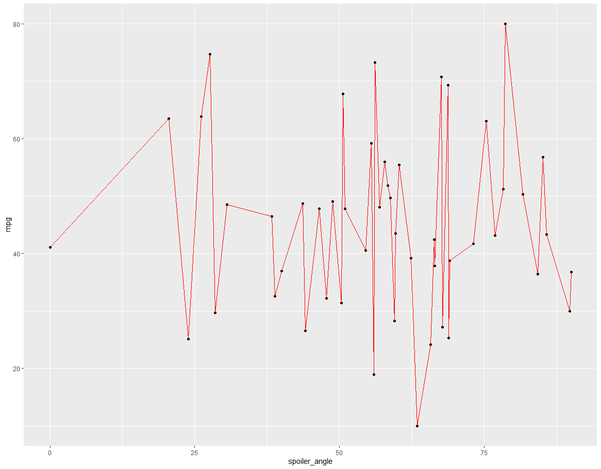
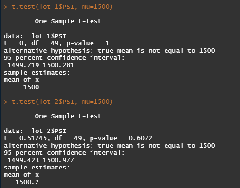

# MechaCar_Statistical_Analysis
Module 15 Challenge

## Linear Regression to Predict MPG

We are using several variables, vehicle_length + vehicle_weight + spoiler_angle + ground_clearance + AWD to predict MPG based on already charted values on table  [MechaCar_mpg.csv](MechaCar_mpg.csv) .

using the model:

We can build the multiple Linear Regression model below:

      #Multiple Linear Regression model:
      #mpg = (6.267e+00)vehicle_length + (1.245e-03)vehicle_weight + (6.877e-02)spoiler_angle + (3.546e+00)ground_clearance + (-3.411e+00)AWD + (-1.040e+02)

Calculating the Summary P and R-squared Values:

Our multiple R-squared:  0.7149 and  our p-value: 5.35e-11

- Which variables/coefficients provided a non-random amount of variance to the mpg values in the dataset?

The following values from the above summary informs us that the vehicle_length & ground_clearance are variables that provide non-random amount of variance to the mpg values (note the asterisks *** to the right of the two values in the diagram above as well as to the right of the intercept 

The diagram shows an non flat trajectory for the two values, 

and the spoiler shows flat/unpredictable plot

- Is the slope of the linear model considered to be zero? Why or why not?

  | Importance  of Findings | Significance Level | Probability  of Being Wrong |
  | ----------------------- | ------------------ | --------------------------- |
  | Low                     | 0.1                | 1 in 10                     |
  | Normal                  | 0.05               | 5 in 100                    |
  | High                    | 0.01               | 1 in 100                    |
  | Very high               | 0.001              | 1 in 1,000                  |
  | Extreme                 | 0.0001             | 1 in 10,000                 |

  The slope is not zero as evident from the two variants provided above as well as the P-value = 5.35e-11, based on this chart the p-value is much smaller than normal significance level so we can reject the null hypothesis since the slow of the linear model is not zero.

- Does this linear model predict mpg of MechaCar prototypes effectively? Why or why not?

  It does predict 71% of MPG predictions for the MechaCar prototypes will be correct because the model is Multiple R-Squared advises us that there is a strong correlation 

## Summary Statistics on Suspension Coils

- The design specifications for the MechaCar suspension coils dictate that the variance of the suspension coils must not exceed 100 pounds per square inch. Does the current manufacturing data meet this design specification for all manufacturing lots in total and each lot individually? Why or why not?

  The Variance calculated for the combined manufactured lots is approximately 62, this is below the 100 psi design specifications

However separating the analysis by manufacturing lots, we can see that Lot3 is outside of MechaCar design specifications. 

## T-Tests on Suspension Coils 

We run a comparison of all the manufacturing lots against the industry standard of 1,500 PSI coils.

We find that the P-value is above 0.05, so we have a greater chance of probability of being wrong than the acceptable Normal of .05, our calculated p-value is larger than our significance level, we would state that we do not have sufficient evidence to reject our null hypothesis, and therefore we fail to reject our null hypothesis between the means of the PSI for the population and the MechaCar Manufacturing lots..

Looking further into the individual lots, we see that Lot 1 and Lot 2 are within P-values 1 and 0.6, well within the significant levels,

However Lot 3 Shows a lower p-value below 0.05, which 

our calculated p-value 0.04 is smaller than our significance level, we would state that there is sufficient statistical evidence that our null hypothesis is not true, and therefore we would reject our null hypothesis.

This box plot shows how much more variance and unpredictable the Lot 3 is.

## Study Design: MechaCar vs Competition

- The statistical study design has the following:
  - Some metrics that might be of interest to a customer is improving fuel efficiency over the competition, would adding additional engine options such as hybrid, electric or diesel powered vehicle improve the MPG. Also perhaps low rolling resistance and narrow tires.
  - Null hypothesis: The MPG achieved for MechaCars is equal to their competitors
  - Alternative hypothesis: The MPG for MechaCars is not equal to their competitors
  - A statistical test is described to test the hypothesis would be to test the similar displacement engine as the competitors, or the average of all the offerings of engines of MechaCars against all the available engine options of the competitors.
  - The data for the statistical test is to determine if which engine options allow MechaCar to achieve the best combination of MPG to match or exceed the mean of their competitors would be the engine type and/or displacement. Tire widths and rolling resistance data
